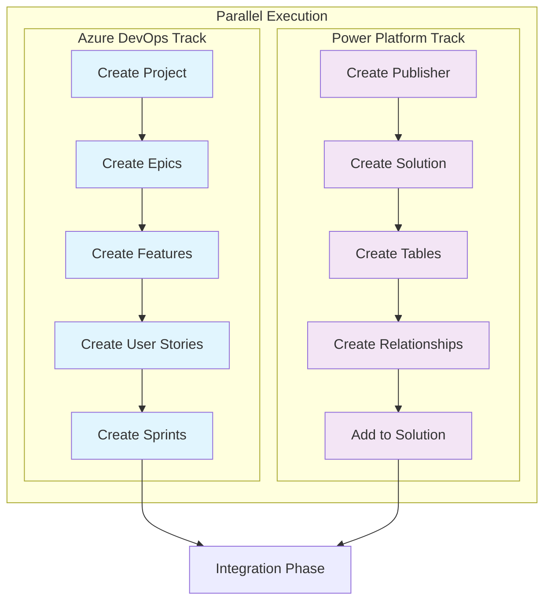
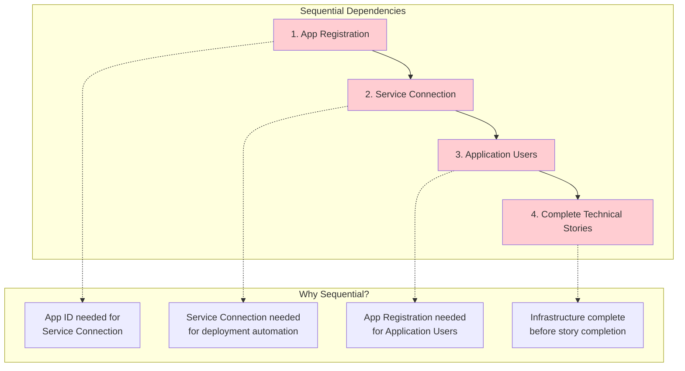
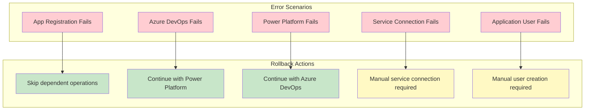

# Power Platform Orchestration Agent - Architecture Flow

## High-Level Sequence Diagram

```mermaid
sequenceDiagram
    participant User as 👤 User
    participant Claude as 🤖 Claude Desktop
    participant Orch as 🎭 PRD Orchestrator
    participant Graph as 📊 Microsoft Graph MCP
    participant ADO as 🔧 Azure DevOps MCP
    participant PP as ⚡ Power Platform MCP
    participant AAD as 🔐 Azure AD
    participant DevOps as 📋 Azure DevOps
    participant Dataverse as 💾 Dataverse

    Note over User, Dataverse: Phase 1: PRD Creation & Parsing
    User->>Claude: "Create Power Platform project from PRD"
    Claude->>Orch: Import PRD (YAML/JSON/Markdown)
    Orch->>Orch: Parse & validate PRD
    Orch->>Orch: Generate work breakdown structure
    
    Note over User, Dataverse: Phase 2: Foundation Setup (Sequential)
    Orch->>Graph: Create Azure AD App Registration
    Graph->>AAD: POST /applications
    AAD-->>Graph: App ID + Object ID
    Graph->>AAD: Add client secret
    AAD-->>Graph: Client Secret
    Graph->>AAD: Grant admin consent
    AAD-->>Graph: Permissions granted
    Graph->>Graph: Save credentials to .env
    Graph-->>Orch: ✅ App Registration Complete

    Note over User, Dataverse: Phase 3: Parallel Infrastructure Setup
    par Azure DevOps Setup
        Orch->>ADO: Create project
        ADO->>DevOps: POST /projects
        DevOps-->>ADO: Project created
        
        ADO->>DevOps: Create epics
        DevOps-->>ADO: Epics created
        
        ADO->>DevOps: Create features  
        DevOps-->>ADO: Features created
        
        ADO->>DevOps: Create user stories
        DevOps-->>ADO: Stories created
        
        ADO->>DevOps: Create sprints
        DevOps-->>ADO: Sprints created
        
        ADO-->>Orch: ✅ Azure DevOps Complete
        
    and Power Platform Setup
        Orch->>PP: Create publisher
        PP->>Dataverse: POST /publishers
        Dataverse-->>PP: Publisher created
        
        PP->>Dataverse: POST /solutions
        Dataverse-->>PP: Solution created
        
        PP->>Dataverse: Create custom tables
        Dataverse-->>PP: Tables created
        
        PP->>Dataverse: Create relationships
        Dataverse-->>PP: Relationships created
        
        PP-->>Orch: ✅ Power Platform Complete
    end

    Note over User, Dataverse: Phase 4: Cross-System Integration (Sequential)
    Orch->>Graph: Create Azure DevOps Service Connection
    Graph->>DevOps: POST /serviceConnections (Power Platform type)
    DevOps-->>Graph: Service connection created
    Graph-->>Orch: ✅ Service Connection Complete

    Orch->>PP: Create Application Users (per environment)
    loop For each environment
        PP->>Dataverse: POST /systemusers (Application User)
        Dataverse-->>PP: User created
        PP->>Dataverse: Assign System Administrator role
        Dataverse-->>PP: Role assigned
    end
    PP-->>Orch: ✅ Application Users Complete

    Note over User, Dataverse: Phase 5: Auto-Complete Technical Stories
    Orch->>ADO: Mark technical stories as complete
    ADO->>DevOps: PATCH /workitems (Close technical stories)
    DevOps-->>ADO: Stories closed
    ADO-->>Orch: ✅ Technical Stories Complete

    Note over User, Dataverse: Phase 6: Project Ready
    Orch-->>Claude: 🎉 Project orchestration complete
    Claude-->>User: ✅ Power Platform project ready for development!
```

## Parallel vs Sequential Operations

### 🔄 **Parallel Operations** (Can run simultaneously)

#### Phase 3: Infrastructure Setup

### ⚡ **Sequential Operations** (Must be done in order)

#### Critical Dependencies

## System Architecture Overview

```mermaid
graph TB
    subgraph "User Interface"
        Claude[🤖 Claude Desktop]
        PRD[📄 PRD Assistant]
    end
    
    subgraph "Orchestration Layer"
        Orch[🎭 PRD Orchestrator]
        API[🌐 REST API]
    end
    
    subgraph "MCP Servers"
        GraphMCP[📊 Microsoft Graph MCP]
        ADOMCP[🔧 Azure DevOps MCP] 
        PPMCP[⚡ Power Platform MCP]
    end
    
    subgraph "Microsoft Cloud Services"
        AAD[🔐 Azure AD]
        DevOps[📋 Azure DevOps]
        PP[🏢 Power Platform]
        Dataverse[💾 Dataverse]
    end
    
    Claude --> Orch
    PRD --> Orch
    Orch --> API
    
    API --> GraphMCP
    API --> ADOMCP
    API --> PPMCP
    
    GraphMCP --> AAD
    ADOMCP --> DevOps
    PPMCP --> PP
    PPMCP --> Dataverse
    
    style Claude fill:#e3f2fd
    style Orch fill:#fff3e0
    style GraphMCP fill:#f1f8e9
    style ADOMCP fill:#f1f8e9
    style PPMCP fill:#f1f8e9
    style AAD fill:#fce4ec
    style DevOps fill:#fce4ec
    style PP fill:#fce4ec
    style Dataverse fill:#fce4ec
```

## Timing & Performance Optimization

### ⏱️ **Estimated Execution Times**

| Phase | Operation | Time | Notes |
|-------|-----------|------|-------|
| 1 | PRD Parsing | 1-2s | Local processing |
| 2 | App Registration | 5-10s | Azure AD API calls |
| 3a | Azure DevOps Setup | 15-30s | Project + work items |
| 3b | Power Platform Setup | 20-40s | Publisher + solution + tables |
| 4 | Service Connection | 3-5s | Single API call |
| 5 | Application Users | 5-10s per env | Role assignment included |
| 6 | Story Completion | 2-5s | Bulk update |

**Total Time: ~45-90 seconds** (depending on complexity)

### 🚀 **Performance Benefits of Parallel Execution**

- **Without Parallelization**: 60-100 seconds total
- **With Parallelization**: 45-90 seconds total  
- **Time Savings**: 15-25% reduction

## Error Handling & Rollback Strategy

## Key Design Decisions

### 🎯 **Why This Sequence?**

1. **App Registration First**: Everything depends on having valid Azure AD credentials
2. **Parallel Infrastructure**: Azure DevOps and Power Platform are independent 
3. **Service Connection After**: Needs App Registration to exist
4. **Application Users Last**: Requires both App Registration and environments to exist
5. **Story Completion Final**: All infrastructure must be ready before marking complete

### 🔧 **MCP Server Benefits**

- **Modularity**: Each system has dedicated MCP server
- **Reliability**: Direct REST API calls, no CLI dependencies  
- **Authentication**: Proper OAuth 2.0 + interactive fallback
- **Error Handling**: Granular error reporting per system
- **Testability**: Individual MCP servers can be tested independently

### 🌟 **Tool-Agnostic Integration**

The orchestrator can accept PRDs from:
- **Claude Desktop**: Natural conversation + PRD Assistant
- **GitHub Copilot**: Exported PRD documents
- **Manual Input**: Direct YAML/JSON/Markdown upload
- **Templates**: Pre-built project templates
- **File Import**: Local or remote PRD files

This design ensures maximum flexibility while maintaining robust automation capabilities across the entire Microsoft ecosystem.